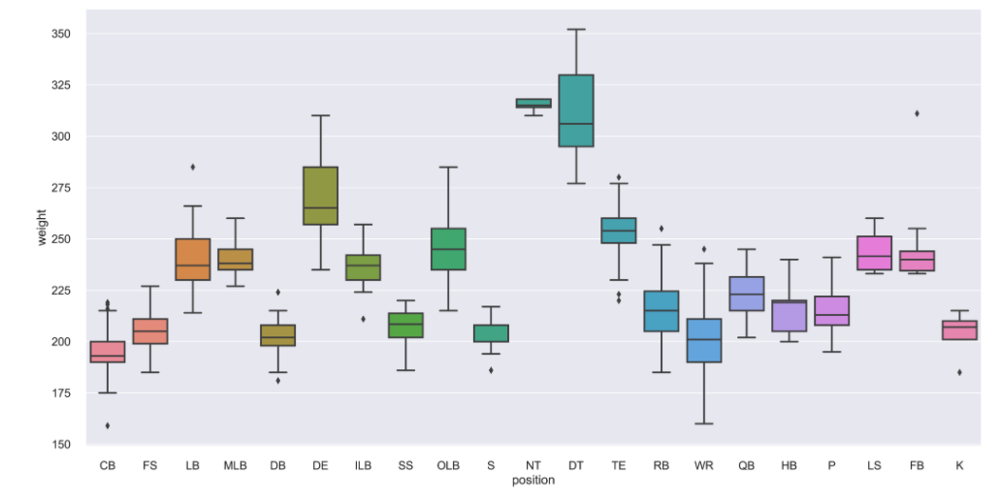

# DSI_Capstone

## README: James Gibbins DSI Capstone - V1.1

## INTRODUCTION / AIMS

Hello!

This project aims to use GPS tracking data of NFL players to predict the outcome of passing plays based on the movements of key players from the offensive and defensive teams.

The primary goal of the project is to classify whether a play will ultimately be successful for the offense or defense based on the relative movements of players a maximum of 1 second after the pass is thrown. The project hopes to glean useful insights from this time period to aid coaches analysis of plays and make recommendations for improvements on both the offensive and defensive side of the ball.

The project on this notebook uses data sourced from the 2021 NFL Big Data Bowl hosted by kaggle:
https://www.kaggle.com/c/nfl-big-data-bowl-2021/overview

### GLOSSARY OF TERMS (for the unfamiliar with NFL):

Field: The NFL field is 120 yards by 53.3 yards - with the 10 yards at each end being the scoring zones

Offense: the team which is attempting to progress the ball down the field and ultimately score

Defense: conversely the team attempting to prevent the offense from progressing

Line of Scrimmage: The imaginary line that represents the offense’s progress prior to the play, it is the line on which the ball is positioned at the start of each play.

Ball Snap: This is the first moment the play is live and the ball is moved by the offensive team

Pass Forward: On each play the offensive team is allowed to pass the ball forward only one time

QuarterBack (QB): The specialist passer - the player on each team who almost always passes the ball forward

Receiver (Rec): Each offense has a number of receivers who try to get open (in space away from the defenders) in order to catch a pass from the QB

Down: The offensive team has 4 attempts (or downs) to progress the ball 10 yards closer to the defending team’s end zone

## DATA:

The data provided is GPS tracking of players on passing plays. The data covers all 32 teams from the 17 weeks of the 2018 season. 

Each play is broken down in to frames of 0.1 second time increments. 

The tracking data includes x and y coordinates for each player relative to the field yardage (x= 0 - 120 , y = 0 - 53.3). Also speed, acceleration and distance measurements.

Data also includes player orientation and direction of travel as a bearing where 0 degrees is parallel to the y axis. 

## EDA & DATA CLEANING

[Notebook](https://github.com/jgibbins1990/DSI_Capstone/blob/main/DSI_Capstone_Code_EDA%26Cleaning.ipynb)

Data was provided in 20 csv files:
- Player Information (1 csv file)
- Game Information (1 csv file)
- Play Information (1 csv file)
- GPS Tracking Data (17 csv files)

The linked notebook shows data cleaning steps and EDA of the raw data. Some example EDA for the player information is shown below:

### SELECTING DATA FOR ANALYSIS

- We can see that the ball snap generally occurs after 11 frames (1.1 second). The snap is the first moment where the play is live.
- On average there is a pass forward made around 2.6 - 2.8 seconds after the snap
- On average passing outcomes occur 1.5 seconds after the pass is thrown
- For the analysis I used GPS data from 4 frames of each play. The Snap / Pass Forward / 0.5 seconds after pass / 1.0 seconds after pass.

### PLOTTING DATA:

[Notebook]()

I plotted the data for each play using plotly express. This allowed me to clearly visually represent the players movements on the field of play and break down the plays for analysis.

An example play is shown below broken down into the 4 frames highlighted. 

#### Ball Snap - frame 11

In the above frame (11) we see the offensive (green) and defense (purple) lined up either side of the line of scrimmage.

#### Pass Forward - frame 36

In the above frame (36) we see the offense has moved the ball to the QB Matt Ryan. He will now attempt to pass the ball to one of the offensive receivers and the defensive players will attempt to prevent the pass being completed or block the progress of the receiver.

#### Pass Forward + 0.5 s - frame 41

In the above frame (41) the pass is made and the ball is travelling towards the intended receiver.

#### Pass Forward + 1 s - frame 46

In the above frame (46) the pass is made and the ball is travelling towards the intended receiver Julio Jones.

FEATURE ENGINEERING / DATA SELECTION:

I am using featuring engineering to extract players movements relative to each other for each of these frames and changes between the frames.
 
MODELLING:

I use a metric known as EPA (expected points added) to measure the success of the play.

I have binarised this metric based on the median, so that if the epa is greater than the median the play is considered successful for the offense and vice versa for the defense.

I complete binary classification modelling on features I have engineered from selected frames of each play to predict the outcome of the play and whether the offense or defense has been successful.

CONCLUSIONS:

Thanks for reading!
